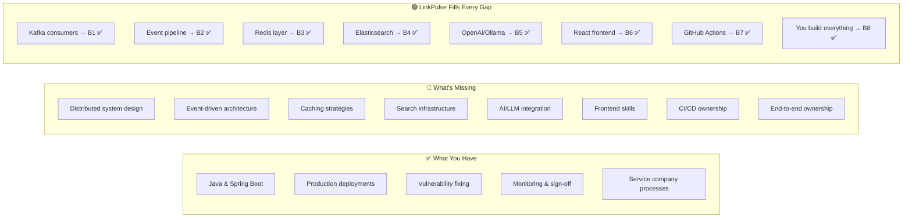
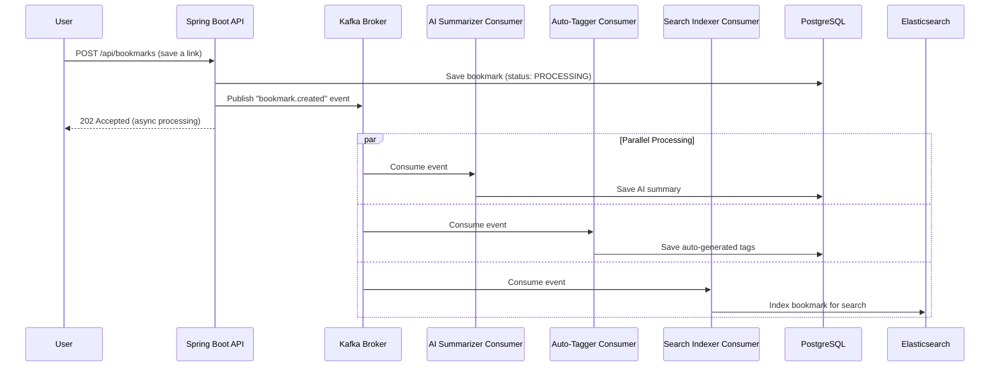
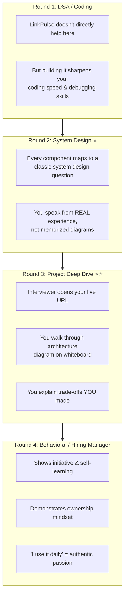

# 🔬 Deep Analysis: Why LinkPulse Is Your Best Career Move

## 1. Your Current Skill Gap — Honest Assessment

Let's map where you are vs. where Microsoft/Atlassian expects you to be:



> [!IMPORTANT]
> The core problem at service companies: you work on **slices** of a system someone else designed. Product companies want people who can **design the whole system**. LinkPulse forces you to make every architectural decision yourself.

---

## 2. Component-by-Component: What You Learn & How It Helps

### 🗄️ PostgreSQL + Flyway Migrations

| What You Build | What You Learn | Interview Question It Answers |
|---|---|---|
| Schema for users, bookmarks, tags, summaries | Database normalization, indexing strategies, foreign key design | *"How would you design the database schema for X?"* |
| Flyway version-controlled migrations | Schema evolution without downtime | *"How do you handle database changes in production?"* |
| Many-to-many relationship (bookmarks ↔ tags) | Join tables, query optimization | *"How would you model a tagging system?"* |

**Why it matters:** At your current role, the DB schema already exists. You patch vulnerabilities in existing queries. You've likely never **designed** a schema from scratch for a product. This changes that.

---

### 🔐 Spring Security 6 + OAuth2 + JWT

| What You Build | What You Learn | Interview Question It Answers |
|---|---|---|
| JWT token issuance & validation | Stateless authentication, token lifecycle | *"How does your authentication system work?"* |
| OAuth2 login (Google/GitHub) | Third-party identity federation | *"How would you implement SSO?"* |
| Role-based access control | Authorization patterns | *"How do you handle permissions in a multi-tenant system?"* |
| CSRF, CORS, security headers | Defense-in-depth security | *"How do you secure a REST API?"* |

**Why it matters:** You fix vulnerabilities today — but can you **design** a secure auth system from scratch? This is the difference between a security maintainer and a security-aware architect. Atlassian's interview explicitly asks about auth design.

---

### 📨 Kafka / RabbitMQ (Event-Driven Architecture)

This is the **single most important** component for your career jump.



| What You Build | What You Learn | Interview Question It Answers |
|---|---|---|
| Kafka producer in API layer | Message publishing, serialization | *"How would you decouple services?"* |
| 3 independent consumers | Consumer groups, parallel processing | *"How do you scale background processing?"* |
| Dead letter queue (DLQ) | Failure handling, poison pill messages | *"What happens when a consumer fails?"* |
| Retry with exponential backoff | Resilience patterns | *"How do you handle transient failures?"* |
| Idempotent consumers | Exactly-once vs at-least-once processing | *"How do you prevent duplicate processing?"* |

**Why it matters:** 

> [!CAUTION]
> **This is the #1 skill gap** that separates service-company engineers from product-company engineers. In service companies, you deploy someone else's Kafka config. Here, you **design the event schema, choose partition keys, handle consumer failures, and reason about ordering guarantees**. Every System Design interview at Microsoft/Atlassian involves async processing — and you'll have a real system to reference.

---

### 🧠 AI/LLM Integration (OpenAI / Ollama)

| What You Build | What You Learn | Interview Question It Answers |
|---|---|---|
| API integration with OpenAI | REST client design, API key management, token budgeting | *"Have you worked with AI/ML APIs?"* |
| Prompt engineering for summaries | Prompt design, response parsing | *"How would you integrate AI into a product?"* |
| Fallback to Ollama (local) | Multi-provider strategy, graceful degradation | *"How do you handle third-party API failures?"* |
| Token/cost management | Rate limiting, budget controls | *"How do you manage costs in an AI system?"* |

**Why it matters:** In 2026, **every** product company is integrating LLMs. Microsoft has Copilot in everything. Atlassian has Rovo AI. An engineer who has hands-on LLM integration experience instantly stands out from candidates who've only done traditional CRUD.

---

### 🔍 Elasticsearch (Full-Text Search)

| What You Build | What You Learn | Interview Question It Answers |
|---|---|---|
| Index mapping for bookmarks | Schema design for search vs. storage | *"How is search different from database queries?"* |
| Full-text search with relevance ranking | TF-IDF, BM25, analyzers | *"How would you implement search in a product?"* |
| Search-as-you-type (autocomplete) | Edge n-gram tokenizers, prefix queries | *"How does autocomplete work?"* |
| Keeping ES in sync with PostgreSQL | Dual-write vs. event-driven sync (you use Kafka!) | *"How do you keep search in sync with your DB?"* |

**Why it matters:** Atlassian Confluence, Jira — search is core to their products. Microsoft's everything has search. You'll be able to discuss search architecture with real experience, not textbook theory.

---

### ⚡ Redis Caching

| What You Build | What You Learn | Interview Question It Answers |
|---|---|---|
| Cache frequently accessed bookmarks | Cache-aside pattern, TTL strategies | *"How do you use caching to improve performance?"* |
| Cache user sessions / JWT metadata | Session management at scale | *"Where do you store session data?"* |
| Cache invalidation on bookmark update | Cache consistency, write-through vs write-behind | *"How do you handle cache invalidation?"* (the hardest problem in CS!) |
| Rate limiter using Redis | Sliding window counter pattern | *"How would you implement rate limiting?"* |

---

### 📊 Prometheus + Grafana (Observability)

| What You Build | What You Learn | Interview Question It Answers |
|---|---|---|
| Custom metrics (bookmarks saved/min, AI latency) | Metric design, instrumentation | *"How do you monitor your services?"* |
| Grafana dashboards | Visualization, alerting thresholds | *"How do you know something is wrong in production?"* |
| Health checks & readiness probes | Kubernetes-style health patterns | *"How does your deployment handle unhealthy instances?"* |
| Distributed tracing with correlation IDs | Request tracing across services | *"How do you debug issues in a distributed system?"* |

**Why it matters:** You already do monitoring — but as a consumer of dashboards someone else built. Now you **design the metrics, build the dashboards, set the alerts**. In interviews, you'll say *"I instrumented my own system"* instead of *"I watched someone else's Grafana."*

---

## 3. How LinkPulse Helps in Each Interview Round



### Round 2 (System Design) — Your Secret Weapon

When the interviewer asks *"Design a notification system"*, most candidates draw theoretical boxes. **You** say:

> *"In LinkPulse, I built exactly this. When a user saves a bookmark, I publish a `bookmark.created` event to Kafka. Three independent consumers process it in parallel — the summarizer, the tagger, and the search indexer. I chose Kafka over RabbitMQ because I needed ordering guarantees within a user's bookmarks. I handle failures with a dead-letter queue and exponential backoff retries. Let me draw the exact architecture I implemented..."*

**This is 10x more convincing** than reciting a textbook answer.

### Round 3 (Project Deep Dive) — The Differentiator

> [!IMPORTANT]
> At Microsoft (SDE-2) and Atlassian (P3/P4), the project deep-dive round can **make or break** your candidacy. Interviewers probe for:
> - **Depth:** *"Why Kafka over RabbitMQ?"* — You have a real answer.
> - **Trade-offs:** *"Why Elasticsearch and not just PostgreSQL full-text search?"* — You tried both.
> - **Failure handling:** *"What if OpenAI is down?"* — You built fallback logic.
> - **Scale thinking:** *"What if you have 1M users?"* — You can reason about partition keys, consumer scaling.

---

## 4. Comparison: Why LinkPulse Beats Other Common Projects

| Project | Daily Use? | Tech Depth | Interview Value | Uniqueness | Verdict |
|---------|:----------:|:----------:|:---------------:|:----------:|---------|
| **Todo App** | ❌ Boring | 🔴 Low | 🔴 Every candidate has one | 🔴 Overused | ❌ Skip |
| **E-commerce Clone** | ❌ Won't use | 🟡 Medium | 🟡 Decent | 🔴 Very common | ❌ Skip |
| **Chat Application** | 🟡 Maybe | 🟡 Medium | 🟡 Good for WebSocket | 🟡 Common | 🟡 OK |
| **URL Shortener** | 🟡 Rarely | 🟡 Medium | 🟢 Classic SD question | 🔴 Overused | 🟡 OK |
| **Blog Platform** | ❌ Medium does it | 🟡 Medium | 🔴 Unimpressive | 🔴 Very common | ❌ Skip |
| **Weather Dashboard** | ❌ Apps exist | 🔴 Low | 🔴 Low | 🔴 Overused | ❌ Skip |
| **🟢 LinkPulse** | ✅ Daily! | 🟢 **Very High** | 🟢 **Excellent** | 🟢 **Unique** | ✅ **Build this** |

### Why others fail:

1. **Todo / Blog / Weather apps** → Interviewers have seen 10,000 of these. Zero differentiation. Zero system design depth.

2. **E-commerce clones** → You'll never use it, so you'll lose motivation. Also, explaining "I built a fake Amazon" isn't compelling.

3. **URL Shortener** → Great for learning, but the scope is too small. You can't talk about it for 45 minutes in an interview.

4. **Chat apps** → Decent, but narrow — it mainly demonstrates WebSockets. LinkPulse covers WebSockets **plus** 7 other technologies.

### Why LinkPulse wins:

- **It solves YOUR real problem** — every developer drowns in saved links and articles
- **It's uniquely yours** — no interviewer has seen "LinkPulse" before
- **It has layered depth** — you can go shallow (CRUD) or deep (event-driven AI pipeline) depending on the interview
- **It grows with you** — you'll keep adding features because you actually use it

---

## 5. Daily Usability — You'll Actually Keep Building It

This is the **most underrated factor**. Here's how you'll use LinkPulse every single day:

| Daily Activity | How LinkPulse Helps |
|---|---|
| Reading tech articles | Save with one click (browser extension), get AI summary later |
| Interview prep | Save LeetCode problems with tags like `#dp`, `#graph`, `#microsoft` |
| Learning new tech | Save tutorials, auto-categorized by topic |
| Job hunting | Save job postings, company research, interview experiences |
| Code bookmarks | Save GitHub repos, Stack Overflow answers, documentation pages |
| Daily standup/notes | Quick-search through your knowledge base |

> [!TIP]
> Projects built out of **genuine need** are always better than projects built as "portfolio exercises." Interviewers can sense the difference. When you say *"I built this because I needed it, and I've been using it for 3 months"* — that's authentic and compelling.

---

## 6. What a Single "Save Link" Action Teaches You

When a user saves one bookmark, here's what happens in your system — and what you learn:

```
User clicks "Save" in browser extension
    │
    ├─→ [HTTP/REST]       API design, request validation, error handling
    ├─→ [Spring Security]  JWT validation, authorization check
    ├─→ [PostgreSQL]       Write to DB with proper transaction management
    ├─→ [Kafka Producer]   Publish event with proper serialization
    │
    ├─→ [Kafka Consumer 1] AI Summarizer
    │   ├─→ [HTTP Client]  Call OpenAI with retry logic
    │   ├─→ [Resilience4j] Circuit breaker if OpenAI is down
    │   └─→ [PostgreSQL]   Update bookmark with summary
    │
    ├─→ [Kafka Consumer 2] Auto-Tagger
    │   ├─→ [AI/NLP]       Classify content into categories
    │   └─→ [PostgreSQL]   Insert tag associations
    │
    ├─→ [Kafka Consumer 3] Search Indexer
    │   └─→ [Elasticsearch] Index document for full-text search
    │
    ├─→ [WebSocket]        Notify frontend: "processing complete"
    ├─→ [Redis]            Invalidate cache for user's bookmark list
    ├─→ [Prometheus]       Increment counter, record latency histogram
    └─→ [Grafana]          Dashboard updates in real-time
```

**One user action touches 12+ technologies.** That's the depth product companies want to see.

---

## 7. Resume Impact: Before vs. After

### ❌ Before (Current Resume)
```
• Identified and fixed security vulnerabilities in Java applications
• Deployed releases to production and monitored system health
• Coordinated with teams for production sign-off
```
*Interviewer thinks: "Maintenance engineer. Follows processes. Limited design exposure."*

### ✅ After (With LinkPulse)
```
• Designed and built LinkPulse — an AI-powered knowledge management 
  platform serving [X] active users (live: linkpulse.app)
• Architected event-driven pipeline using Kafka for async processing 
  of AI summarization, auto-tagging, and search indexing
• Implemented full-text search with Elasticsearch, reducing content 
  discovery time by 80% compared to SQL queries
• Built OAuth2 + JWT auth system with Spring Security 6, supporting 
  Google and GitHub SSO
• Achieved 95%+ test coverage using JUnit 5 and Testcontainers; 
  deployed via GitHub Actions CI/CD to Railway
```
*Interviewer thinks: "This person designs systems, makes architectural decisions, ships products, and understands modern infrastructure. Let's interview them."*

---

## 8. Cost to Host (It's Nearly Free)

| Service | Free Tier | Monthly Cost After Free |
|---------|-----------|------------------------|
| **Railway** (app hosting) | \$5 free credit/month | ~\$5–10 |
| **Supabase** (PostgreSQL) | 500 MB free | \$0 |
| **Upstash** (Redis) | 10K commands/day free | \$0 |
| **Upstash** (Kafka) | 10K messages/day free | \$0 |
| **Bonsai** (Elasticsearch) | Free sandbox | \$0 |
| **OpenAI API** | Pay-per-use | ~\$1–3/month for personal use |
| **Total** | | **~\$5–13/month** |

> [!TIP]
> Alternatively, use **Ollama** (free, runs locally) instead of OpenAI for AI features, and deploy everything on a single **\$5/month VPS** (Hetzner/DigitalOcean) using Docker Compose. Total cost: **\$5/month**.

---

## Summary: The Strategic Value of LinkPulse

| Dimension | How LinkPulse Helps |
|-----------|-------------------|
| **Skill gaps** | Fills every gap between service-company and product-company expectations |
| **Interview readiness** | Gives you real answers for System Design, Project Deep Dive, and Behavioral rounds |
| **Resume differentiation** | Transforms your profile from "maintenance engineer" to "system designer and builder" |
| **Daily motivation** | You'll actually use it, so you'll keep improving it |
| **Live URL** | Tangible proof that you can ship and operate a product |
| **Conversation starter** | Interviewers will remember "the person who built their own knowledge manager" |
| **Technology breadth** | 12+ modern technologies in one cohesive project |
| **Technology depth** | Each component can be discussed for 15+ minutes in an interview |
| **Cost** | Nearly free to host |
| **Time to MVP** | 2 weeks to a working version, 8 weeks to a polished showcase |

> [!IMPORTANT]
> **The bottom line:** LinkPulse isn't just a project — it's a **career accelerator**. Every hour you spend building it simultaneously teaches you a new technology, gives you an interview story, adds a line to your resume, and creates a tool you'll use tomorrow. No other project gives you this 4-in-1 return on your time investment.
