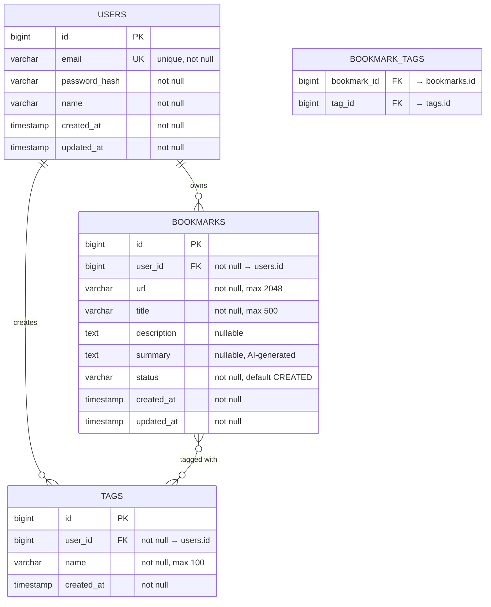

# LinkPulse — Product Requirements Document (PRD)

> **Version:** 1.0
> **Last Updated:** 2026-09-26
> **Status:** Ready for Implementation

---

## 1. Product Vision

### 1.1 What Is LinkPulse?

LinkPulse is a **personal bookmark and knowledge management platform** that lets you save links, automatically generate AI summaries and tags, and search across your entire saved knowledge base.

### 1.2 Problem Statement

Developers and knowledge workers save hundreds of links — articles, tutorials, Stack Overflow answers, GitHub repos, documentation pages — across browser bookmarks, Slack messages, notes apps, and email drafts. When they need to find something later, they can't. The content is scattered, unsearchable, and lacks context.

### 1.3 Solution

A single platform where:
- You save a link (via API, web UI, or browser extension)
- AI automatically summarizes the content and assigns tags
- Everything is full-text searchable
- You own and control all your data

### 1.4 Target User

**You** — a developer who reads technical content daily and needs a reliable personal knowledge base. Secondary users: any knowledge worker, student, or researcher.

---

## 2. User Stories

### 2.1 Core (Phase 1)

| ID | As a... | I want to... | So that... |
|----|---------|-------------|------------|
| US-1 | user | register with email and password | I have my own account |
| US-2 | user | log in and receive a token | I can access my bookmarks securely |
| US-3 | user | save a bookmark (URL + title + optional description) | I don't lose useful links |
| US-4 | user | see all my bookmarks, newest first | I can browse what I've saved |
| US-5 | user | view a single bookmark's details | I can read my notes on it |
| US-6 | user | update a bookmark's title or description | I can fix mistakes or add notes |
| US-7 | user | delete a bookmark I no longer need | I keep my collection clean |
| US-8 | user | not see other users' bookmarks | my data is private |

### 2.2 Organization (Phase 1–2)

| ID | As a... | I want to... | So that... |
|----|---------|-------------|------------|
| US-9 | user | create custom tags (e.g., "java", "career", "devops") | I can categorize my bookmarks |
| US-10 | user | assign multiple tags to a bookmark | a bookmark can belong to multiple categories |
| US-11 | user | filter bookmarks by one or more tags | I can find topic-specific content |
| US-12 | user | paginate through my bookmarks (20 per page) | the app is fast even with thousands of bookmarks |
| US-13 | user | sort bookmarks by date created or title | I find what I need quickly |

### 2.3 Intelligence (Phase 2)

| ID | As a... | I want to... | So that... |
|----|---------|-------------|------------|
| US-14 | user | see an AI-generated summary after saving a link | I remember what the article was about without re-reading |
| US-15 | user | see auto-suggested tags on my bookmark | I don't have to manually categorize everything |
| US-16 | user | know the processing status of a bookmark | I know when the summary is ready |
| US-17 | user | save a bookmark even if AI processing fails | I never lose a link due to AI errors |

### 2.4 Search & Discovery (Phase 3)

| ID | As a... | I want to... | So that... |
|----|---------|-------------|------------|
| US-18 | user | search across all my bookmarks (title, description, summary, tags) | I can find any saved knowledge instantly |
| US-19 | user | see the most relevant results first | I don't waste time scrolling |
| US-20 | user | get search suggestions as I type | searching is fast and intuitive |

### 2.5 Frontend & Extension (Phase 4)

| ID | As a... | I want to... | So that... |
|----|---------|-------------|------------|
| US-21 | user | use a clean web dashboard to manage bookmarks | I don't need Postman to use my app |
| US-22 | user | save a link from any browser tab with one click | saving is frictionless |
| US-23 | user | see real-time updates when processing completes | I don't need to refresh the page |

---

## 3. Architecture Overview

### 3.1 High-Level Architecture

```
┌──────────────────────────────────────────────────────────┐
│                       CLIENTS                            │
│  ┌──────────┐  ┌──────────────┐  ┌───────────────────┐  │
│  │ React UI │  │ Browser Ext. │  │ REST Client/curl  │  │
│  └────┬─────┘  └──────┬───────┘  └────────┬──────────┘  │
└───────┼───────────────┼────────────────────┼─────────────┘
        │               │                    │
        ▼               ▼                    ▼
┌──────────────────────────────────────────────────────────┐
│                   SPRING BOOT API                        │
│                                                          │
│  ┌─────────────┐ ┌──────────────┐ ┌───────────────────┐ │
│  │ Auth Filter │→│ Controllers  │→│    Services        │ │
│  │ (JWT)       │ │              │ │                    │ │
│  └─────────────┘ └──────────────┘ └────────┬──────────┘ │
│                                            │            │
│                    ┌───────────────────┬────┴────┐       │
│                    ▼                   ▼         ▼       │
│            ┌──────────────┐  ┌──────────┐ ┌──────────┐  │
│            │ Repositories │  │  Redis   │ │ Event    │  │
│            │ (JPA)        │  │  Cache   │ │ Publisher│  │
│            └──────┬───────┘  └──────────┘ └────┬─────┘  │
└───────────────────┼────────────────────────────┼────────┘
                    ▼                            ▼
            ┌──────────────┐            ┌──────────────┐
            │ PostgreSQL   │            │  RabbitMQ    │
            └──────────────┘            └──────┬───────┘
                                               │
                                    ┌──────────┼──────────┐
                                    ▼          ▼          ▼
                              ┌──────────┐┌────────┐┌──────────┐
                              │Summarizer││Tagger  ││Indexer   │
                              │Consumer  ││Consumer││Consumer  │
                              └────┬─────┘└───┬────┘└────┬─────┘
                                   │          │          │
                                   ▼          ▼          ▼
                              ┌──────────┐┌────────┐┌──────────┐
                              │OpenAI API││  DB    ││Elastic-  │
                              └──────────┘└────────┘│search    │
                                                    └──────────┘
```

### 3.2 Package Structure

```
com.linkpulse/
├── LinkPulseApplication.java
│
├── auth/                         ← Phase 1 (Weekend 3)
│   ├── User.java                    Entity
│   ├── UserRepository.java         Data access
│   ├── AuthService.java            Register, login logic
│   ├── AuthController.java         POST /auth/register, /auth/login
│   ├── RegisterRequest.java        DTO
│   ├── LoginRequest.java           DTO
│   ├── AuthResponse.java           DTO (contains JWT token)
│   └── JwtService.java             Token generation & validation
│
├── bookmark/                     ← Phase 1 (Weekends 1-2)
│   ├── Bookmark.java                Entity
│   ├── BookmarkRepository.java      Data access
│   ├── BookmarkService.java         Business logic
│   ├── BookmarkController.java      REST endpoints
│   ├── CreateBookmarkRequest.java   DTO
│   ├── UpdateBookmarkRequest.java   DTO
│   ├── BookmarkResponse.java        DTO
│   └── BookmarkNotFoundException.java
│
├── tag/                          ← Phase 1 (Weekend 2)
│   ├── Tag.java                     Entity
│   ├── TagRepository.java           Data access
│   ├── TagService.java              Business logic
│   ├── TagController.java           REST endpoints
│   ├── CreateTagRequest.java        DTO
│   └── TagResponse.java             DTO
│
├── processing/                   ← Phase 2 (Weekends 6-7)
│   ├── BookmarkEvent.java           Event model
│   ├── EventPublisher.java          Publishes to RabbitMQ
│   ├── SummaryConsumer.java         Consumes & generates summaries
│   ├── AutoTagConsumer.java         Consumes & assigns tags
│   └── SearchIndexConsumer.java     Consumes & indexes in ES
│
├── ai/                           ← Phase 2 (Weekend 7)
│   ├── AiService.java               Interface
│   ├── OpenAiService.java           OpenAI implementation
│   └── AiConfig.java                Configuration
│
├── search/                       ← Phase 3 (Weekend 9)
│   ├── BookmarkDocument.java        Elasticsearch document
│   ├── SearchService.java           Full-text search logic
│   └── SearchController.java        GET /bookmarks/search
│
├── config/                       ← Cross-cutting
│   ├── SecurityConfig.java          Spring Security setup
│   ├── JwtAuthenticationFilter.java JWT filter
│   ├── RedisConfig.java             Redis cache config
│   ├── RabbitMqConfig.java          Queue/exchange setup
│   └── WebSocketConfig.java         WebSocket for real-time
│
└── exception/                    ← Cross-cutting
    ├── GlobalExceptionHandler.java  Centralized error handling
    └── ErrorResponse.java           Standard error DTO
```

---

## 4. Database Schema

### 4.1 Entity Relationship Diagram



### 4.2 Migration Files (in order)

#### V1__create_users_table.sql

```sql
CREATE TABLE users (
    id             BIGSERIAL PRIMARY KEY,
    email          VARCHAR(255) NOT NULL UNIQUE,
    password_hash  VARCHAR(255) NOT NULL,
    name           VARCHAR(100) NOT NULL,
    created_at     TIMESTAMP WITH TIME ZONE NOT NULL DEFAULT NOW(),
    updated_at     TIMESTAMP WITH TIME ZONE NOT NULL DEFAULT NOW()
);

CREATE UNIQUE INDEX idx_users_email ON users (email);
```

#### V2__create_bookmarks_table.sql

```sql
CREATE TABLE bookmarks (
    id           BIGSERIAL PRIMARY KEY,
    user_id      BIGINT NOT NULL REFERENCES users(id) ON DELETE CASCADE,
    url          VARCHAR(2048) NOT NULL,
    title        VARCHAR(500) NOT NULL,
    description  TEXT,
    summary      TEXT,
    status       VARCHAR(20) NOT NULL DEFAULT 'CREATED',
    created_at   TIMESTAMP WITH TIME ZONE NOT NULL DEFAULT NOW(),
    updated_at   TIMESTAMP WITH TIME ZONE NOT NULL DEFAULT NOW()
);

CREATE INDEX idx_bookmarks_user_id ON bookmarks (user_id);
CREATE INDEX idx_bookmarks_url ON bookmarks (url);
CREATE INDEX idx_bookmarks_created_at ON bookmarks (user_id, created_at DESC);
CREATE INDEX idx_bookmarks_status ON bookmarks (status);
```

#### V3__create_tags_table.sql

```sql
CREATE TABLE tags (
    id          BIGSERIAL PRIMARY KEY,
    user_id     BIGINT NOT NULL REFERENCES users(id) ON DELETE CASCADE,
    name        VARCHAR(100) NOT NULL,
    created_at  TIMESTAMP WITH TIME ZONE NOT NULL DEFAULT NOW(),

    -- Each user can have a tag name only once
    CONSTRAINT uq_tags_user_name UNIQUE (user_id, name)
);

CREATE INDEX idx_tags_user_id ON tags (user_id);
```

#### V4__create_bookmark_tags_table.sql

```sql
CREATE TABLE bookmark_tags (
    bookmark_id  BIGINT NOT NULL REFERENCES bookmarks(id) ON DELETE CASCADE,
    tag_id       BIGINT NOT NULL REFERENCES tags(id) ON DELETE CASCADE,

    PRIMARY KEY (bookmark_id, tag_id)
);

CREATE INDEX idx_bookmark_tags_tag_id ON bookmark_tags (tag_id);
```

### 4.3 Bookmark Status Values

| Status | Meaning | Set When |
|--------|---------|----------|
| `CREATED` | Bookmark saved, no processing started | Bookmark is first created |
| `PROCESSING` | AI summarization/tagging in progress | Event is consumed by workers |
| `COMPLETED` | All processing finished successfully | All consumers finish |
| `FAILED` | Processing failed (bookmark is still saved) | Consumer encounters unrecoverable error |

### 4.4 Design Decisions

| Decision | Choice | Reasoning |
|----------|--------|-----------|
| Primary key type | `BIGSERIAL` | Simpler than UUID, better index performance for single-DB app |
| Soft delete vs hard delete | Hard delete (`ON DELETE CASCADE`) | Simpler for a personal tool. Add soft delete if you want "trash" feature later |
| Tag scope | Per-user | Each user has their own tag namespace. User A's "java" tag ≠ User B's |
| Bookmark-tag relationship | Many-to-many via join table | A bookmark can have multiple tags; a tag can be on multiple bookmarks |
| Timestamps | `TIMESTAMP WITH TIME ZONE` | Avoids timezone bugs. Always store in UTC |

---

## 5. API Specification

> **Base URL:** `http://localhost:8080/api`
> All endpoints except auth require `Authorization: Bearer <jwt_token>` header.

### 5.1 Authentication

---

#### `POST /auth/register`

Create a new user account.

**Request:**
```json
{
    "email": "user@example.com",
    "password": "securePassword123",
    "name": "John Doe"
}
```

**Validation rules:**
- `email` — required, valid email format, unique (not already registered)
- `password` — required, minimum 8 characters
- `name` — required, max 100 characters

**Response (201 Created):**
```json
{
    "token": "eyJhbGciOiJIUzI1NiJ9...",
    "user": {
        "id": 1,
        "email": "user@example.com",
        "name": "John Doe"
    }
}
```

**Error (409 Conflict):**
```json
{
    "status": 409,
    "error": "Conflict",
    "message": "An account with this email already exists",
    "timestamp": "2026-09-26T10:30:00Z"
}
```

---

#### `POST /auth/login`

Authenticate and receive a JWT token.

**Request:**
```json
{
    "email": "user@example.com",
    "password": "securePassword123"
}
```

**Response (200 OK):**
```json
{
    "token": "eyJhbGciOiJIUzI1NiJ9...",
    "user": {
        "id": 1,
        "email": "user@example.com",
        "name": "John Doe"
    }
}
```

**Error (401 Unauthorized):**
```json
{
    "status": 401,
    "error": "Unauthorized",
    "message": "Invalid email or password",
    "timestamp": "2026-09-26T10:30:00Z"
}
```

---

### 5.2 Bookmarks

---

#### `POST /bookmarks`

Save a new bookmark. Returns immediately with status `CREATED`. AI processing happens asynchronously.

**Request:**
```json
{
    "url": "https://martinfowler.com/articles/microservices.html",
    "title": "Microservices by Martin Fowler",
    "description": "Comprehensive guide to microservice architecture",
    "tagIds": [1, 3, 5]
}
```

**Validation rules:**
- `url` — required, valid URL format, max 2048 characters
- `title` — required, max 500 characters
- `description` — optional, max 5000 characters
- `tagIds` — optional, array of existing tag IDs belonging to the current user

**Response (201 Created):**
```json
{
    "id": 42,
    "url": "https://martinfowler.com/articles/microservices.html",
    "title": "Microservices by Martin Fowler",
    "description": "Comprehensive guide to microservice architecture",
    "summary": null,
    "status": "CREATED",
    "tags": [
        { "id": 1, "name": "architecture" },
        { "id": 3, "name": "microservices" },
        { "id": 5, "name": "design" }
    ],
    "createdAt": "2026-09-26T10:30:00Z",
    "updatedAt": "2026-09-26T10:30:00Z"
}
```

---

#### `GET /bookmarks`

List the current user's bookmarks with pagination, sorting, and optional tag filtering.

**Query parameters:**

| Param | Type | Default | Description |
|-------|------|---------|-------------|
| `page` | int | `0` | Page number (0-based) |
| `size` | int | `20` | Items per page (max 100) |
| `sort` | string | `createdAt,desc` | Sort field and direction. Fields: `createdAt`, `title`, `updatedAt` |
| `tag` | string | — | Filter by tag name (exact match, case-insensitive) |
| `status` | string | — | Filter by status: `CREATED`, `PROCESSING`, `COMPLETED`, `FAILED` |

**Example:** `GET /bookmarks?page=0&size=10&sort=createdAt,desc&tag=java`

**Response (200 OK):**
```json
{
    "content": [
        {
            "id": 42,
            "url": "https://martinfowler.com/articles/microservices.html",
            "title": "Microservices by Martin Fowler",
            "description": "Comprehensive guide...",
            "summary": "This article defines microservices as...",
            "status": "COMPLETED",
            "tags": [
                { "id": 1, "name": "architecture" }
            ],
            "createdAt": "2026-09-26T10:30:00Z",
            "updatedAt": "2026-09-26T10:35:00Z"
        }
    ],
    "page": {
        "number": 0,
        "size": 20,
        "totalElements": 145,
        "totalPages": 8
    }
}
```

---

#### `GET /bookmarks/{id}`

Get a single bookmark by ID. Returns 404 if not found or if it belongs to a different user.

**Response (200 OK):** Same shape as a single item in the list above.

**Response (404 Not Found):**
```json
{
    "status": 404,
    "error": "Not Found",
    "message": "Bookmark not found with id: 42",
    "timestamp": "2026-09-26T10:30:00Z"
}
```

---

#### `PUT /bookmarks/{id}`

Update a bookmark's title, description, or tags. Cannot change the URL (create a new bookmark instead).

**Request:**
```json
{
    "title": "Updated title",
    "description": "Updated description with more context",
    "tagIds": [1, 2, 7]
}
```

**Validation rules:**
- `title` — optional (keeps existing if not provided), max 500 characters
- `description` — optional, max 5000 characters
- `tagIds` — optional, replaces all existing tags

**Response (200 OK):** Full bookmark object with updated fields.

---

#### `DELETE /bookmarks/{id}`

Delete a bookmark. Also removes associated tag relationships and search index entry.

**Response (204 No Content):** Empty body.
**Response (404 Not Found):** If bookmark doesn't exist or belongs to another user.

---

### 5.3 Tags

---

#### `POST /tags`

Create a new tag for the current user.

**Request:**
```json
{
    "name": "spring-boot"
}
```

**Validation rules:**
- `name` — required, max 100 characters, unique per user (case-insensitive)

**Response (201 Created):**
```json
{
    "id": 5,
    "name": "spring-boot",
    "bookmarkCount": 0,
    "createdAt": "2026-09-26T10:30:00Z"
}
```

**Error (409 Conflict):** If tag name already exists for this user.

---

#### `GET /tags`

List all tags for the current user, with bookmark count for each.

**Response (200 OK):**
```json
[
    { "id": 1, "name": "java", "bookmarkCount": 23, "createdAt": "..." },
    { "id": 2, "name": "spring-boot", "bookmarkCount": 15, "createdAt": "..." },
    { "id": 3, "name": "devops", "bookmarkCount": 8, "createdAt": "..." }
]
```

---

#### `DELETE /tags/{id}`

Delete a tag. Removes all bookmark-tag associations (bookmarks themselves are NOT deleted).

**Response (204 No Content).**

---

### 5.4 Search (Phase 3)

---

#### `GET /bookmarks/search`

Full-text search across title, description, summary, and tag names.

**Query parameters:**

| Param | Type | Required | Description |
|-------|------|----------|-------------|
| `q` | string | yes | Search query (min 2 characters) |
| `page` | int | no | Page number, default `0` |
| `size` | int | no | Results per page, default `20` |

**Example:** `GET /bookmarks/search?q=spring+boot+microservices`

**Response (200 OK):**
```json
{
    "content": [
        {
            "id": 42,
            "url": "https://...",
            "title": "Microservices with Spring Boot",
            "summary": "This article covers...",
            "tags": ["java", "spring-boot", "microservices"],
            "score": 12.5,
            "createdAt": "2026-09-26T10:30:00Z"
        }
    ],
    "page": {
        "number": 0,
        "size": 20,
        "totalElements": 5,
        "totalPages": 1
    }
}
```

---

### 5.5 Health & Info

#### `GET /actuator/health`

Standard Spring Boot health endpoint.

```json
{
    "status": "UP",
    "components": {
        "db": { "status": "UP" },
        "redis": { "status": "UP" },
        "rabbit": { "status": "UP" }
    }
}
```

---

## 6. Authentication & Security Design

### 6.1 JWT Structure

```
Header:  { "alg": "HS256", "typ": "JWT" }
Payload: { "sub": "1", "email": "user@example.com", "iat": 1695724200, "exp": 1695810600 }
Signature: HMACSHA256(base64(header) + "." + base64(payload), SECRET_KEY)
```

| Field | Description |
|-------|-------------|
| `sub` | User ID (string) |
| `email` | User's email |
| `iat` | Issued at (Unix timestamp) |
| `exp` | Expires at (24 hours after `iat`) |

### 6.2 Authentication Flow

```
1. User calls POST /auth/login with email + password
2. Server verifies password against stored BCrypt hash
3. Server generates JWT with user info, signs with secret key
4. Server returns JWT in response body
5. Client stores JWT (localStorage for web, secure storage for mobile)
6. Client sends JWT in every request: Authorization: Bearer <token>
7. JwtAuthenticationFilter extracts & validates token on every request
8. If valid → set SecurityContext with user info → request proceeds
9. If invalid/missing → return 401 Unauthorized
```

### 6.3 Endpoint Security Rules

| Endpoint Pattern | Access |
|-----------------|--------|
| `POST /auth/register` | Public (no auth) |
| `POST /auth/login` | Public (no auth) |
| `GET /actuator/health` | Public |
| Everything else (`/bookmarks/**`, `/tags/**`, etc.) | Authenticated only |

### 6.4 Password Rules

- Minimum 8 characters
- Stored as BCrypt hash (never plain text)
- BCrypt strength: 10 rounds (default)

### 6.5 Security Headers

- Stateless sessions (no cookies, no CSRF needed)
- CORS: Allow `localhost:3000` in dev, your frontend domain in prod
- Content-Type validation: reject requests without `application/json`

---

## 7. Event-Driven Processing (Phase 2)

### 7.1 Event Flow

```
Bookmark Created (API)
    │
    ▼
EventPublisher.publish(BookmarkCreatedEvent)
    │
    ▼
RabbitMQ Exchange: "bookmark.exchange" (topic)
    │
    ├──→ Queue: "bookmark.summary"   → SummaryConsumer
    │                                      │
    │                                      ├─ Fetch URL content (Jsoup)
    │                                      ├─ Call OpenAI API for summary
    │                                      ├─ Save summary to DB
    │                                      └─ Update status → COMPLETED
    │
    ├──→ Queue: "bookmark.autotag"   → AutoTagConsumer
    │                                      │
    │                                      ├─ Call OpenAI API for tag suggestions
    │                                      ├─ Create tags if they don't exist
    │                                      └─ Associate tags with bookmark
    │
    └──→ Queue: "bookmark.index"     → SearchIndexConsumer (Phase 3)
                                           │
                                           └─ Index bookmark in Elasticsearch
```

### 7.2 Event Schema

```java
// BookmarkCreatedEvent — published to RabbitMQ
public record BookmarkCreatedEvent(
    Long bookmarkId,
    Long userId,
    String url,
    String title,
    String description,
    Instant createdAt
) {}
```

### 7.3 RabbitMQ Configuration

| Resource | Name | Purpose |
|----------|------|---------|
| Exchange | `bookmark.exchange` | Topic exchange for bookmark events |
| Queue | `bookmark.summary` | Consumed by SummaryConsumer |
| Queue | `bookmark.autotag` | Consumed by AutoTagConsumer |
| Queue | `bookmark.index` | Consumed by SearchIndexConsumer |
| Routing Key | `bookmark.created` | Binds all 3 queues to the exchange |
| DLQ Exchange | `bookmark.dlx` | Dead letter exchange for failed messages |
| DLQ Queue | `bookmark.dlq` | Stores failed messages for inspection |

### 7.4 Failure Handling

| Scenario | Behaviour |
|----------|-----------|
| OpenAI API timeout | Retry 3 times with exponential backoff (1s, 2s, 4s) |
| OpenAI API returns error | Retry 3 times, then send to DLQ, set bookmark status → `FAILED` |
| URL cannot be fetched (404, timeout) | Summarize using title + description only (fallback) |
| Consumer crashes | Message remains in queue (unacknowledged), RabbitMQ redelivers |
| Poison message (always fails) | After 3 retries, route to DLQ |

### 7.5 AI Prompts

**Summarization prompt:**
```
Summarize the following article in 2-3 sentences. Be concise and capture the key points.

Title: {title}
Content: {extractedContent}
```

**Auto-tagging prompt:**
```
Given the following article, suggest 1-5 tags from this list: [java, spring-boot, python, javascript, react, devops, cloud, aws, database, sql, api, microservices, architecture, security, testing, career, ai, machine-learning, frontend, backend, performance, docker, kubernetes, git, linux].

If none of the provided tags fit, suggest up to 2 new short tags (lowercase, hyphenated).

Title: {title}
Content: {extractedContent}

Respond with only a JSON array of tag strings, e.g.: ["java", "spring-boot", "api"]
```

---

## 8. Caching Strategy (Phase 2)

### 8.1 What to Cache

| Key Pattern | Value | TTL | Invalidation |
|-------------|-------|-----|--------------|
| `bookmarks:user:{userId}:page:{page}` | Serialized page of bookmarks | 5 minutes | On create, update, or delete any bookmark for this user |
| `bookmark:{id}` | Single bookmark | 10 minutes | On update or delete |
| `tags:user:{userId}` | User's tag list | 10 minutes | On create or delete any tag |

### 8.2 Cache Strategy: Cache-Aside

```
GET /bookmarks
    │
    ├─ Check Redis for cached page
    │   ├─ HIT → return cached data (fast, ~1ms)
    │   └─ MISS → query PostgreSQL → store in Redis → return
    │
POST /bookmarks (or PUT, DELETE)
    │
    └─ Evict all cached pages for this user
       (because any mutation could change any page's content)
```

### 8.3 Rate Limiting

| Tier | Limit | Window |
|------|-------|--------|
| Per user | 100 requests | 1 minute |
| Per user (writes) | 20 requests | 1 minute |

Implementation: Redis-based sliding window counter. Return `429 Too Many Requests` when exceeded.

---

## 9. Search Design (Phase 3)

### 9.1 Elasticsearch Index Mapping

```json
{
    "mappings": {
        "properties": {
            "bookmarkId":  { "type": "long" },
            "userId":      { "type": "long" },
            "url":         { "type": "keyword" },
            "title":       { "type": "text", "analyzer": "standard" },
            "description": { "type": "text", "analyzer": "standard" },
            "summary":     { "type": "text", "analyzer": "standard" },
            "tags":        { "type": "keyword" },
            "createdAt":   { "type": "date" }
        }
    }
}
```

### 9.2 Search Behaviour

- Search across: `title`, `description`, `summary`, `tags`
- Boost `title` matches (3x weight) over `description` (1x)
- Filter results by `userId` (users only see their own bookmarks)
- Sort by relevance score (default) or date

### 9.3 Keeping ES in Sync

- **On bookmark create/update:** `SearchIndexConsumer` receives the event from RabbitMQ and indexes the document in Elasticsearch.
- **On bookmark delete:** `BookmarkService.deleteBookmark()` also calls `SearchService.deleteFromIndex(bookmarkId)`.
- **Full reindex:** Build a management endpoint (`POST /admin/reindex`) that reads all bookmarks from PostgreSQL and re-indexes them. Useful for recovery.

---

## 10. Monitoring & Observability (Phase 3)

### 10.1 Custom Metrics (Prometheus)

| Metric Name | Type | Description |
|-------------|------|-------------|
| `linkpulse_bookmarks_created_total` | Counter | Total bookmarks created |
| `linkpulse_bookmarks_deleted_total` | Counter | Total bookmarks deleted |
| `linkpulse_ai_summary_duration_seconds` | Histogram | AI summarization latency |
| `linkpulse_ai_summary_failures_total` | Counter | Failed AI summarizations |
| `linkpulse_search_query_duration_seconds` | Histogram | Search query latency |
| `linkpulse_auth_login_total` | Counter | Login attempts (tag: success/failure) |
| `linkpulse_cache_hit_total` | Counter | Redis cache hits |
| `linkpulse_cache_miss_total` | Counter | Redis cache misses |

### 10.2 Structured Logging

Every log line should include:
```
timestamp | level | correlationId | userId | message
```

Use MDC (Mapped Diagnostic Context) to set `correlationId` at the start of each request (in a filter) and clear it after.

### 10.3 Health Checks

| Component | Health Check |
|-----------|-------------|
| PostgreSQL | Connection pool test |
| Redis | `PING` command |
| RabbitMQ | Connection status |
| Elasticsearch | Cluster health API |

---

## 11. Frontend Spec (Phase 4)

### 11.1 Pages

| Page | Route | Description |
|------|-------|-------------|
| Login | `/login` | Email + password form |
| Register | `/register` | Name + email + password form |
| Dashboard | `/` | Bookmark list with search bar and tag sidebar |
| Bookmark Detail | `/bookmarks/{id}` | Full bookmark with summary, tags, metadata |
| Settings | `/settings` | Account info (stretch goal) |

### 11.2 Dashboard Layout

```
┌─────────────────────────────────────────────────────┐
│  🔗 LinkPulse                    [+ New]  [Avatar]  │
├────────────┬────────────────────────────────────────┤
│            │  🔍 Search bookmarks...                │
│  TAGS      │────────────────────────────────────────│
│            │                                        │
│  All (145) │  ┌──────────────────────────────────┐  │
│  java (23) │  │ 📄 Microservices by M. Fowler    │  │
│  spring(15)│  │ ⏱ 2 min ago  🏷 java, arch      │  │
│  devops (8)│  │ AI: This article defines micro...│  │
│  cloud (6) │  └──────────────────────────────────┘  │
│  ai (4)    │                                        │
│            │  ┌──────────────────────────────────┐  │
│            │  │ 📄 Redis Caching Patterns        │  │
│            │  │ ⏱ 1 day ago  🏷 redis, backend  │  │
│            │  │ AI: Covers cache-aside, write... │  │
│            │  └──────────────────────────────────┘  │
│            │                                        │
│            │  [Load more...]                        │
└────────────┴────────────────────────────────────────┘
```

### 11.3 Browser Extension

- **Popup:** Shows a "Save to LinkPulse" button with title pre-filled from the current tab
- **Context menu:** Right-click any link → "Save to LinkPulse"
- **Badge:** Shows count of bookmarks saved today
- **Auth:** Stores JWT token in `chrome.storage.local`

---

## 12. Non-Functional Requirements

### 12.1 Performance

| Metric | Target |
|--------|--------|
| API response time (p95) | < 200ms for reads, < 500ms for writes |
| Search response time (p95) | < 300ms |
| AI processing time | < 15 seconds (async, user not waiting) |
| Dashboard page load | < 2 seconds |

### 12.2 Security

- All passwords hashed with BCrypt (strength 10)
- JWT signed with HS256, secret ≥ 256 bits
- JWT expiry: 24 hours
- SQL injection protection: JPA parameterized queries (never string concatenation)
- Input validation on all endpoints
- CORS whitelist: only your frontend domain
- No secrets in code or Git (use environment variables)
- Rate limiting on auth endpoints (prevent brute force)

### 12.3 Reliability

- Bookmark save never fails due to AI failure (decouple with message queue)
- Dead letter queue captures failed messages for debugging
- Circuit breaker on OpenAI API (prevent cascade failures)
- Retry with exponential backoff on transient failures
- Database connection pooling (HikariCP, default in Spring Boot)

### 12.4 Scalability Considerations

This is a personal tool, so scale isn't critical — but design it **as if** it needed to scale, because that's what interviewers ask about:

| Interview: "How would you scale X?" | Your design answer |
|------|--------|
| "More users?" | Stateless JWT → any server can handle any request → horizontal scaling behind a load balancer |
| "More bookmarks?" | Database indexing on `user_id + created_at`. Pagination prevents full-table scans |
| "Slow AI processing?" | Message queue decouples API from AI. Add more consumer instances to process faster |
| "Search gets slow?" | Elasticsearch scales horizontally with shards |
| "Cache stampede?" | Cache warming, staggered TTLs, mutex-based cache rebuild |

---

## 13. Environment Configuration

### 13.1 Development (local)

```yaml
# docker-compose.yml provides:
# PostgreSQL → localhost:5432
# Redis → localhost:6379 (Phase 2)
# RabbitMQ → localhost:5672, management: 15672 (Phase 2)
# Elasticsearch → localhost:9200 (Phase 3)

spring:
  datasource:
    url: jdbc:postgresql://localhost:5432/linkpulse
    username: linkpulse
    password: linkpulse123
  jpa:
    hibernate.ddl-auto: validate
    show-sql: true
```

### 13.2 Production (Railway / cloud)

```yaml
spring:
  datasource:
    url: ${DATABASE_URL}
    username: ${DATABASE_USER}
    password: ${DATABASE_PASSWORD}
  jpa:
    hibernate.ddl-auto: validate
    show-sql: false

jwt:
  secret: ${JWT_SECRET}
  expiration: 86400000  # 24 hours in ms

ai:
  openai:
    api-key: ${OPENAI_API_KEY}
    model: gpt-4o-mini
    max-tokens: 300
```

### 13.3 Required Environment Variables (Production)

| Variable | Description | Example |
|----------|-------------|---------|
| `DATABASE_URL` | PostgreSQL connection string | `jdbc:postgresql://host:5432/linkpulse` |
| `DATABASE_USER` | DB username | `linkpulse` |
| `DATABASE_PASSWORD` | DB password | (secret) |
| `JWT_SECRET` | Signing key for JWT (min 256 bits) | (random 64-char hex string) |
| `OPENAI_API_KEY` | OpenAI API key | `sk-...` |
| `REDIS_URL` | Redis connection string | `redis://host:6379` |
| `RABBITMQ_URL` | RabbitMQ connection string | `amqp://host:5672` |
| `ELASTICSEARCH_URL` | Elasticsearch URL | `http://host:9200` |

---

## 14. Standard Error Response Format

All error responses follow this structure:

```json
{
    "status": 404,
    "error": "Not Found",
    "message": "Bookmark not found with id: 42",
    "timestamp": "2026-09-26T10:30:00Z",
    "errors": {
        "title": "Title is required",
        "url": "Must be a valid URL"
    }
}
```

| Field | Always present? | Description |
|-------|----------------|-------------|
| `status` | Yes | HTTP status code |
| `error` | Yes | HTTP status reason phrase |
| `message` | Yes | Human-readable error message |
| `timestamp` | Yes | When the error occurred (ISO 8601) |
| `errors` | Only for 400 | Field-level validation errors |

### Error Scenarios

| Scenario | Status | Message |
|----------|--------|---------|
| Validation fails | 400 | "Validation failed" + field errors |
| Bad JWT / missing auth | 401 | "Authentication required" |
| Accessing another user's bookmark | 404 | "Bookmark not found with id: X" (not 403, to avoid leaking existence) |
| Email already registered | 409 | "An account with this email already exists" |
| Tag name already exists for user | 409 | "Tag 'java' already exists" |
| Rate limit exceeded | 429 | "Too many requests. Try again in X seconds" |
| Unexpected server error | 500 | "An unexpected error occurred" (never expose internals) |

---

## 15. Phase-wise Implementation Checklist

### Phase 1 — Foundation (Weekends 1–4)

- [ ] Flyway migrations V1–V4
- [ ] `Bookmark` entity, repository, service, controller, DTOs
- [ ] `Tag` entity, repository, service, controller, DTOs
- [ ] Bookmark-tag many-to-many relationship
- [ ] Pagination, sorting, tag filtering on `GET /bookmarks`
- [ ] `User` entity, repository
- [ ] `AuthController` — register, login
- [ ] `JwtService` — generate and validate tokens
- [ ] `JwtAuthenticationFilter` — extract token on every request
- [ ] `SecurityConfig` — protect endpoints, allow auth routes
- [ ] User-scoped data access (each user sees only their bookmarks)
- [ ] `GlobalExceptionHandler` — handle all error scenarios
- [ ] Dockerfile (multi-stage build)
- [ ] Docker Compose (PostgreSQL)
- [ ] Deploy to Railway with live URL
- [ ] README with setup instructions

### Phase 2 — Intelligence (Weekends 5–8)

- [ ] Add Redis to Docker Compose
- [ ] Cache `GET /bookmarks` and `GET /bookmarks/{id}` responses
- [ ] Cache eviction on create/update/delete
- [ ] Rate limiting with Redis
- [ ] Add RabbitMQ to Docker Compose
- [ ] `BookmarkCreatedEvent` record
- [ ] `EventPublisher` — publish on bookmark creation
- [ ] `RabbitMqConfig` — exchanges, queues, DLQ
- [ ] `SummaryConsumer` — fetch content, call OpenAI, save summary
- [ ] `AutoTagConsumer` — call OpenAI, create/associate tags
- [ ] `AiService` — OpenAI REST client with retry logic
- [ ] Bookmark status tracking (`CREATED` → `PROCESSING` → `COMPLETED`/`FAILED`)
- [ ] SpringDoc OpenAPI (Swagger UI)
- [ ] Unit tests (BookmarkService) + integration tests (API endpoints)
- [ ] Redeploy with all services

### Phase 3 — Search & Observability (Weekends 9–12)

- [ ] Add Elasticsearch to Docker Compose
- [ ] `BookmarkDocument` — ES index mapping
- [ ] `SearchIndexConsumer` — index bookmarks on creation
- [ ] `SearchService` — full-text search with relevance scoring
- [ ] `SearchController` — `GET /bookmarks/search?q=...`
- [ ] Resilience4j circuit breaker on OpenAI calls
- [ ] Retry with backoff on external API calls
- [ ] Prometheus + Micrometer metrics
- [ ] Custom metrics (bookmarks created, AI latency, cache hits)
- [ ] Grafana dashboard
- [ ] Structured logging with correlation IDs
- [ ] GitHub Actions CI/CD pipeline
- [ ] Testcontainers for integration tests

### Phase 4 — Frontend & Polish (Weekends 13–16)

- [ ] Next.js project setup with Tailwind CSS
- [ ] Login & register pages
- [ ] Dashboard page (bookmark list, tag sidebar, search bar)
- [ ] Bookmark detail page
- [ ] "Save bookmark" form
- [ ] WebSocket connection for real-time status updates
- [ ] Chrome browser extension (popup + context menu)
- [ ] Deploy frontend to Vercel
- [ ] Demo video / GIF for README
- [ ] Final README polish with architecture diagram, badges, live URL

---

> [!TIP]
> **This PRD is your blueprint.** Implement one section at a time, following the mentorship plan's weekend schedule. If something is unclear, come back and ask — that's exactly what a mentor is for.
